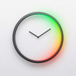
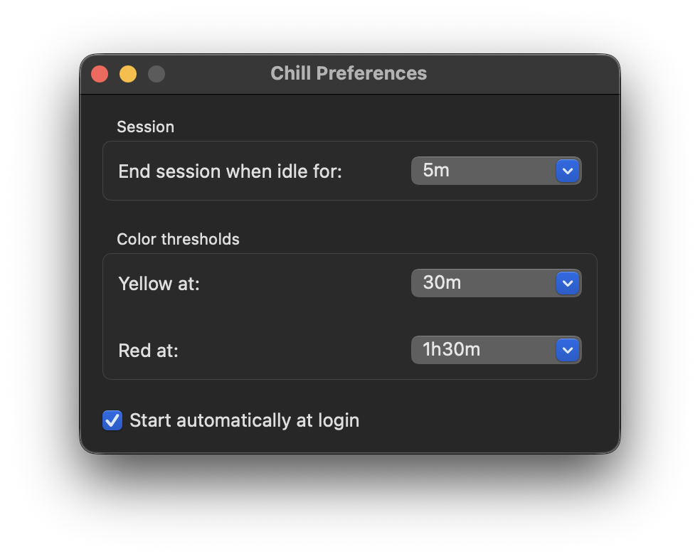

# Chill - Minimalist Sitting Timer for macOS

  

  *Chill is a lightweight menu bar application for macOS designed to help us more mindful of sitting time by tracking how long we've been sitting and provides a gentle, color-coded reminder to rest and chill.*

## Features

*   **Minimalist Menu Bar UI:** A simple timer in your menu bar that stays out of your way.
*   **Color-Coded Timer:** The timer's background color changes from green to yellow to red as your sitting time increases, giving us a quick visual cue.

## Screenshots

### Timer States

### Preferences
